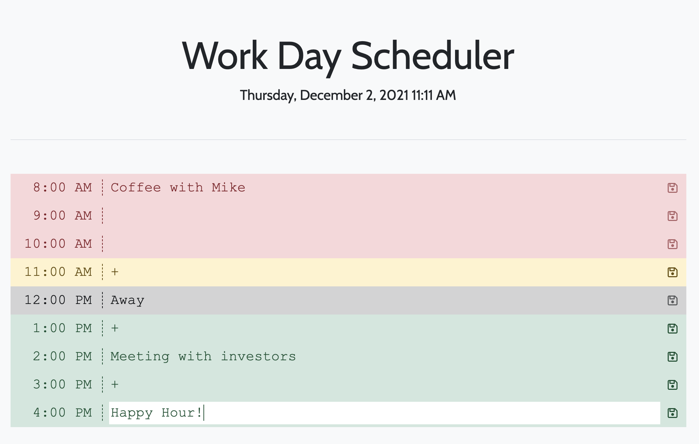

# 📆 work-day-scheduler
This is a calendar application for scheduling out a work day.

## Technology Used
* jQuery
* moment.js
* Bootstrap
* FontAwesome
* Google Fonts

## Description

This application allows a user schedule out their workday by saving each hour block to localStorage. It highlights timeblocks in the past in red, the current hour in yellow, and future time blocks in green (while graying out the lunch hour).

## Setup

* Clone the repo
* Run index.html in your browser

## Deployment

This application is deployed using GitHub pages at this link: https://jmichaelbrown8.github.io/work-day-scheduler/

